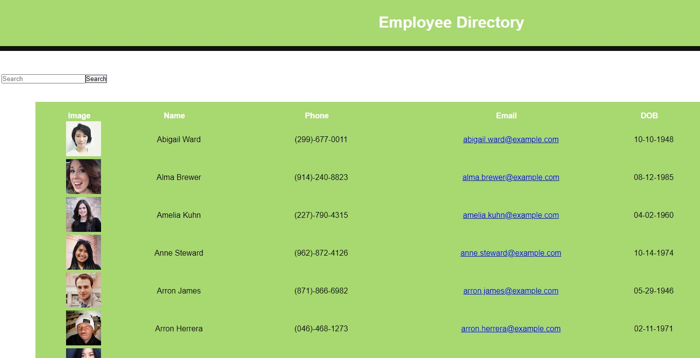

# React-employee-directory

Here is a link to the deployed webpage: [https://react-employee-directory-dep.herokuapp.com/]

## Project Description
* This app utilizes an API to populate random users and then create a directory. Other users on the app can search for employees by "name" and also organize each field (Name, Email, DOB) in ascending or descending order.

## Install and Run the app

* Clone this repo in your terminal with the command git clone or just download it to your computer
* change directory into cd React-employee-directory
* run npm install in your terminal
* run npm start and the app will run locally on port: 8080

## Requirements

I completed this assignment given the acceptance criteria:

    GIVEN a table of random users

    WHEN the user loads the page

    THEN a table of employees should render

## Application

* Search for employees based on the list
* Ability to sort employee list by name

 ## Programs
 * HTML, CSS, Javascript, 
 * Node.js, Express.js, 
 * React JSON

## License 

## Author/s
Beshayr 

 
